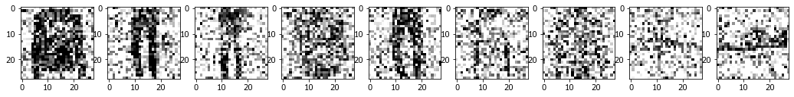
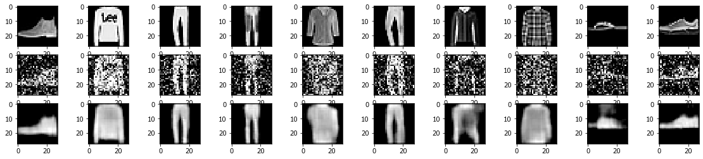

```python
from tensorflow.keras.datasets import mnist
from tensorflow.keras.layers import Conv2D, MaxPooling2D, UpSampling2D
from tensorflow.keras.models import Sequential
import tensorflow as tf

import numpy as np
import matplotlib.pyplot as plt
```


```python
fashion_mnist = tf.keras.datasets.fashion_mnist
(x_train, t_train), (x_test, y_test) = fashion_mnist.load_data()

x_train = x_train.astype('float32') / 255.
x_test = x_test.astype('float32') / 255.
x_train = np.reshape(x_train, (len(x_train), 28, 28, 1))
x_test = np.reshape(x_test, (len(x_test), 28, 28, 1))
```


```python
#adding some noise
noise_factor = 0.45
x_train_noisy = x_train + noise_factor * np.random.normal(loc=0.0, scale=1.0, size=x_train.shape) 
x_test_noisy = x_test + noise_factor * np.random.normal(loc=0.0, scale=1.0, size=x_test.shape) 

x_train_noisy = np.clip(x_train_noisy, 0., 1.)
x_test_noisy = np.clip(x_test_noisy, 0., 1.)

#Displaying images with noise
plt.figure(figsize=(20, 2))
for i in range(1,10):
    ax = plt.subplot(1, 10, i)
    plt.imshow(x_test_noisy[i].reshape(28, 28), cmap="binary")
plt.show()

```





```python
model = Sequential()
model.add(Conv2D(32, (3, 3), activation='relu', padding='same', input_shape=(28, 28, 1)))
model.add(MaxPooling2D((2, 2), padding='same'))
model.add(Conv2D(8, (3, 3), activation='relu', padding='same'))
model.add(MaxPooling2D((2, 2), padding='same'))
model.add(Conv2D(8, (3, 3), activation='relu', padding='same'))
```

    WARNING:tensorflow:From C:\Users\ASUS\Anaconda3\envs\tensorflow\lib\site-packages\tensorflow\python\ops\resource_variable_ops.py:435: colocate_with (from tensorflow.python.framework.ops) is deprecated and will be removed in a future version.
    Instructions for updating:
    Colocations handled automatically by placer.
    


```python
model.add(MaxPooling2D((2, 2), padding='same'))
```


```python
model.add(Conv2D(8, (3, 3), activation='relu', padding='same'))
model.add(UpSampling2D((2, 2)))
model.add(Conv2D(8, (3, 3), activation='relu', padding='same'))
model.add(UpSampling2D((2, 2)))
model.add(Conv2D(32, (3, 3), activation='relu'))
model.add(UpSampling2D((2, 2)))
model.add(Conv2D(1, (3, 3), activation='relu', padding='same'))
```


```python
model.compile(optimizer='adam', loss='mean_squared_error')
```

    WARNING:tensorflow:From C:\Users\ASUS\Anaconda3\envs\tensorflow\lib\site-packages\tensorflow\python\keras\utils\losses_utils.py:170: to_float (from tensorflow.python.ops.math_ops) is deprecated and will be removed in a future version.
    Instructions for updating:
    Use tf.cast instead.
    


```python
model.summary()

```

    _________________________________________________________________
    Layer (type)                 Output Shape              Param #   
    =================================================================
    conv2d (Conv2D)              (None, 28, 28, 32)        320       
    _________________________________________________________________
    max_pooling2d (MaxPooling2D) (None, 14, 14, 32)        0         
    _________________________________________________________________
    conv2d_1 (Conv2D)            (None, 14, 14, 8)         2312      
    _________________________________________________________________
    max_pooling2d_1 (MaxPooling2 (None, 7, 7, 8)           0         
    _________________________________________________________________
    conv2d_2 (Conv2D)            (None, 7, 7, 8)           584       
    _________________________________________________________________
    max_pooling2d_2 (MaxPooling2 (None, 4, 4, 8)           0         
    _________________________________________________________________
    conv2d_3 (Conv2D)            (None, 4, 4, 8)           584       
    _________________________________________________________________
    up_sampling2d (UpSampling2D) (None, 8, 8, 8)           0         
    _________________________________________________________________
    conv2d_4 (Conv2D)            (None, 8, 8, 8)           584       
    _________________________________________________________________
    up_sampling2d_1 (UpSampling2 (None, 16, 16, 8)         0         
    _________________________________________________________________
    conv2d_5 (Conv2D)            (None, 14, 14, 32)        2336      
    _________________________________________________________________
    up_sampling2d_2 (UpSampling2 (None, 28, 28, 32)        0         
    _________________________________________________________________
    conv2d_6 (Conv2D)            (None, 28, 28, 1)         289       
    =================================================================
    Total params: 7,009
    Trainable params: 7,009
    Non-trainable params: 0
    _________________________________________________________________
    


```python
model.fit(x_train_noisy, x_train, epochs=10, batch_size=256, shuffle=True, 
          validation_data=(x_test_noisy, x_test))
```

    Train on 60000 samples, validate on 10000 samples
    WARNING:tensorflow:From C:\Users\ASUS\Anaconda3\envs\tensorflow\lib\site-packages\tensorflow\python\ops\math_ops.py:3066: to_int32 (from tensorflow.python.ops.math_ops) is deprecated and will be removed in a future version.
    Instructions for updating:
    Use tf.cast instead.
    Epoch 1/10
    60000/60000 [==============================] - 77s 1ms/sample - loss: 0.0484 - val_loss: 0.0296
    Epoch 2/10
    60000/60000 [==============================] - 76s 1ms/sample - loss: 0.0277 - val_loss: 0.0262
    Epoch 3/10
    60000/60000 [==============================] - 80s 1ms/sample - loss: 0.0255 - val_loss: 0.0248
    Epoch 4/10
    60000/60000 [==============================] - 82s 1ms/sample - loss: 0.0243 - val_loss: 0.0238
    Epoch 5/10
    60000/60000 [==============================] - 82s 1ms/sample - loss: 0.0232 - val_loss: 0.0229
    Epoch 6/10
    60000/60000 [==============================] - 82s 1ms/sample - loss: 0.0224 - val_loss: 0.0222
    Epoch 7/10
    60000/60000 [==============================] - 82s 1ms/sample - loss: 0.0219 - val_loss: 0.0218
    Epoch 8/10
    60000/60000 [==============================] - 78s 1ms/sample - loss: 0.0215 - val_loss: 0.0214
    Epoch 9/10
    60000/60000 [==============================] - 77s 1ms/sample - loss: 0.0212 - val_loss: 0.0211
    Epoch 10/10
    60000/60000 [==============================] - 79s 1ms/sample - loss: 0.0209 - val_loss: 0.0209
    


    <tensorflow.python.keras.callbacks.History at 0x17f06b7c828>


```python
model.evaluate(x_test_noisy, x_test)

model.save('denoising_autoencoder.model')
```

    10000/10000 [==============================] - 3s 315us/sample - loss: 0.0209
    


```python
no_noise_img = model.predict(x_test_noisy)
```


```python
plt.figure(figsize=(40, 4))
for i in range(10):
    #before noise
    ax = plt.subplot(3, 20, i + 1)
    plt.imshow(x_test[i].reshape(28, 28), cmap="gray")
    
    # display original
    ax = plt.subplot(3, 20, 20 +i+ 1)
    plt.imshow(x_test_noisy[i].reshape(28, 28), cmap="gray")
    
    # display reconstructed (after noise removed) image
    ax = plt.subplot(3, 20, 40 +i+ 1)
    plt.imshow(no_noise_img[i].reshape(28, 28), cmap="gray")

plt.show()
```





```python

```
